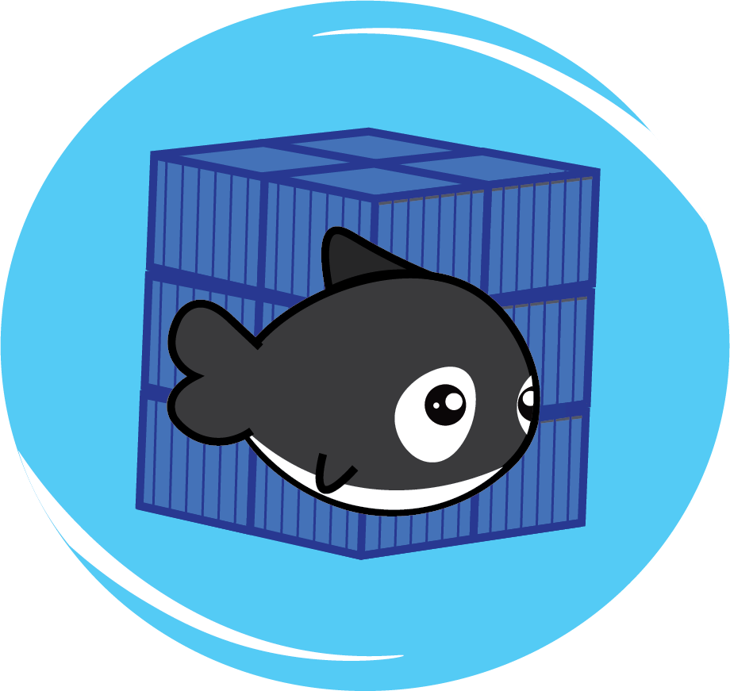

    

  
  
  

<h1 align='center'>Orcastration</h1>
 

    Orcastration is a Docker Swarm visualization tool, giving developers the power to view container metrics of their Docker Swarm with ease! A seamless and efficient GUI gives you insight to CPU usage, memory usage, ,NET I/O, and the health of each of your Docker swarm containers organized neatly by node and task. Say goodbye to clumsy and difficult to understand Docker CLI command outputs and say hello to Orcastration.

 
<h2>How it works</h2>
    

        Orcastration runs Docker CLI commands for you (out of sight and automatically) in order to retrieve Docker Swarm cluster information from the daemon. Data is then processed and graphs are generated in order to represent your various container metrics. Orcastration creates pie and line charts based on live-streamed data, so you can track your container's metrics in real-time. Orcastration also makes it easy to monitor the health and logs of your containers utilizing Docker Health Check. With the simple click of a button, get immediate feedback on the health status of your containers. 
    

<h2>How to use Orcastration</h2>
 
<h3>First:</h3>
<pre>git clone https://github.com/oslabs-beta/Orcastration.git</pre>

Clone this repository to your machine.

 
<h3>Next:</h3>
 
<pre>npm install</pre>

Install dependencies in order to ensure proper app functionality.

 
<h3>Then:</h3>

    Confirm that your Docker Swarm and Docker Desktop are running. Verify that you are running Orcastration on the same machine that is hosting the manager node. The application must be running on the manager node’s machine in order to have the necessary access to the swarm's cluster management functionality.  Please be aware that Orcastration runs on port 8080 and 3000, so be mindful that none of your containers share these ports! Also, understand that the Docker Health Check feature will only function for Docker containers configured with Docker healthcheck in the Dockerfile or the Docker Compose file.
     
    
Click <a style='color:lightblue'href='https://scoutapm.com/blog/how-to-use-docker-healthcheck'>here</a> for more information on Docker Health Check. 

 
<h3>Next:</h3>

    Orcastration utilizes a MongoDB database in order to efficiently serve you data. In order to ensure proper functionality, create a MongoDB database (click <a style='color:lightblue'href='https://www.mongodb.com/basics/create-database'>here</a> for more information on setup). Then, create an .env file in the root of the Orcastration codebase and set an environment variable of 
     
    <pre>MONGO_URI</pre>
    to your newly created MongoDB URI.   Click <a style='color:lightblue'href='https://www.npmjs.com/package/dotenv-webpack'>here</a> for more information on environment variables.
    

 
<h3>Finally...</h3>
<pre>npm run dev</pre>

    Run Orcastration and view your Docker Swarm metrics! (Note: if Orcastration does not run or you encounter errors, try restarting Docker Desktop!)

 
<h2>Want to contribute?</h2>

    Submit a pull request or reach out to one of our team members directly (contact information listed below).

 
<h2>Encounter a bug?</h2>

    Let us know! Submit an issue with the following format and we'll address it as soon as possible. 
     
     
    <h2 style='text-align:center'>What is the bug?</h2>
    <h2 style='text-align:center'>How can you replicate the bug (please include specific steps)?</h2>
    <h2 style='text-align:center'>What is the severity of this bug: high (impacts core functionality), mid (slightly impacts functionality, but app still remains usable), or low (an annoyance)?</h2>

 
<h2>Contributors</h2>
<ul>
  <li>
    Danny Zheng
    
      
  </li>
  <li>
    Andrew Hogan
    
      
  </li>
  <li>
    Meimei Xiong
    
      
  </li>
  <li>
    Max Heubel
    
      
  </li>
    <li>
    Juliana Morrelli
    
      
  </li>
</ul>
